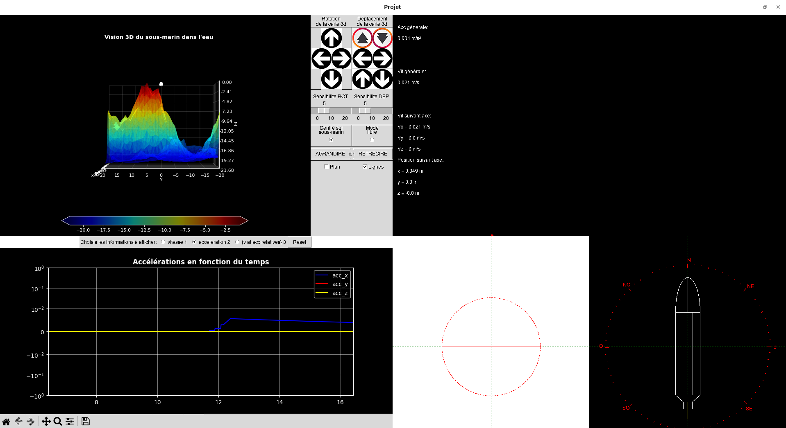

# Submarine Python

## Description

Submarine Python is a desktop simulation of an autonomous submarine. The main
application displays the submarine state with several Tkinter and Matplotlib
views:

- 2D position and orientation views
- Compass and heading display
- 3D terrain/water visualization
- Live speed and acceleration graphs
- Numeric telemetry for speed, acceleration, and position

The repository also contains a `playground/` folder for isolated research
scripts, especially concurrency experiments used to explore possible performance
optimizations for the simulator.

### Dashboard Console



## How To Run

Use Python 3.9 or newer. Python 3.10+ is recommended.

Install the Python dependencies:

```bash
python3 -m pip install -r src/requirements.txt
```

Tkinter is usually included with Python. On Debian/Ubuntu, install it if needed:

```bash
sudo apt-get install python3-tk
```

Launch the simulator from the `src` folder:

```bash
cd src
python3 main.py
```

Controls:

- Right arrow: turn right
- Left arrow: turn left
- Up arrow: decrease ballast water
- Down arrow: increase ballast water
- `z`: increase propeller RPM
- `s`: decrease propeller RPM

---

**Concurrency playground scripts** can be run from here [`playground/concurrency/`](playground/concurrency/). They are separate from the main simulator and can be run independently to test different concurrency approaches.
For example:

```bash
python3 playground/concurrency/process_pool_demo.py
python3 playground/concurrency/multi_window_parallel_refresh_demo.py
```

See `playground/concurrency/README.md` for the full list of demos.

---

## How It Works

The simulator entry point is `src/main.py`. It creates the Tkinter window,
initializes the `submarine` object, and starts the Tkinter event loop.

The main update loop is `submarine.update()`. It is scheduled with Tkinter's
`after()` mechanism, so the simulation can update repeatedly without blocking
the UI event loop. Each update cycle:

1. Computes submarine forces such as buoyancy, weight, drag, and propeller
   thrust.
2. Updates acceleration, speed, heading, and position.
3. Stores recent telemetry values for graphing.
4. Refreshes the visual panels at different frequencies to keep the interface
   responsive.

The display is split across plot modules:

- `plot_1.py`, `plot_2.py`, and `plot_3.py` handle 2D views and compass display.
- `plot_4.py` renders live Matplotlib graphs.
- `plot_6.py` displays numeric telemetry.
- `plot_3d/plot_5.py` renders the 3D scene, using `plot_3d/map.py` and
  `plot_3d/perlin.py` for terrain generation.

The concurrency playground is separate from the simulator code. It is meant for
testing whether multiprocessing, threading, or independent UI processes could
help optimize heavier work in future versions.

